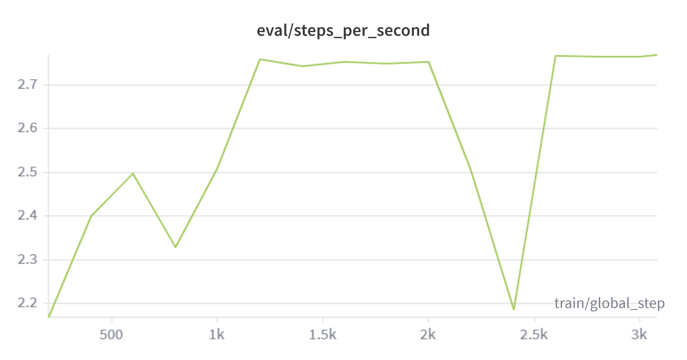
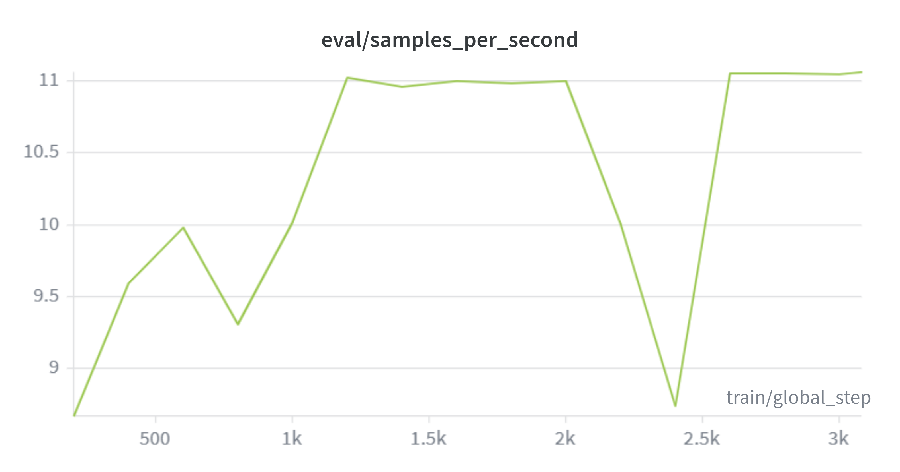
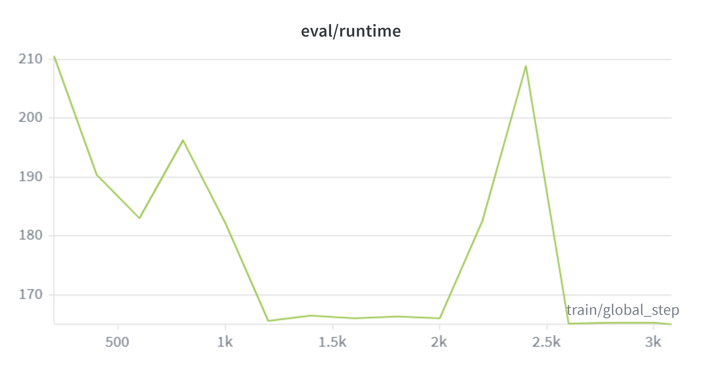
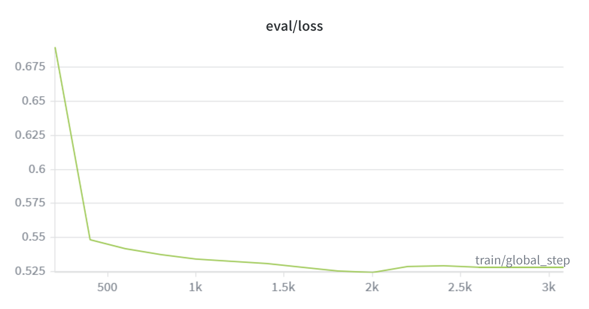
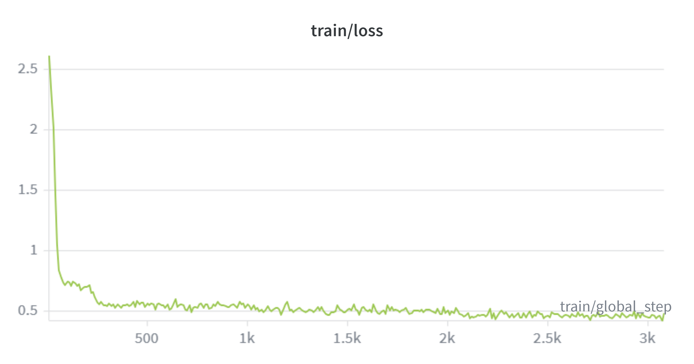
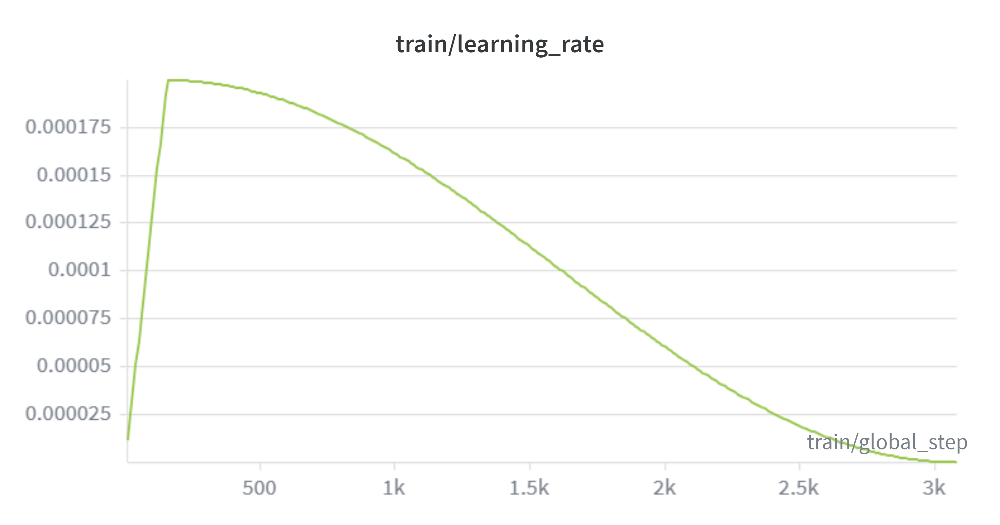
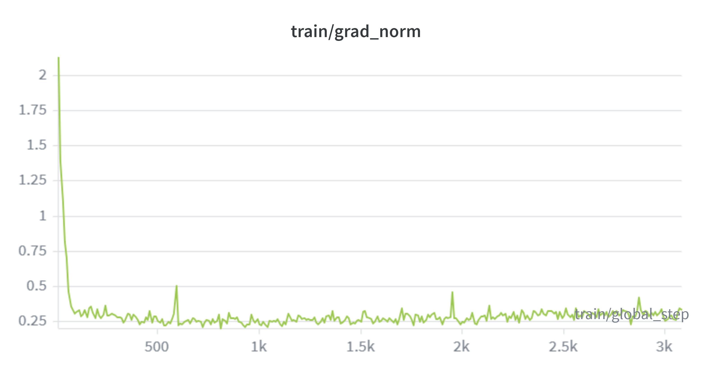
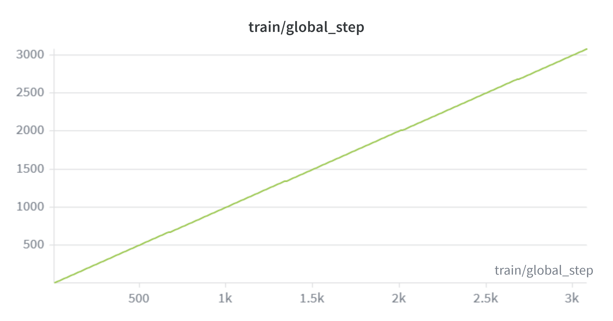
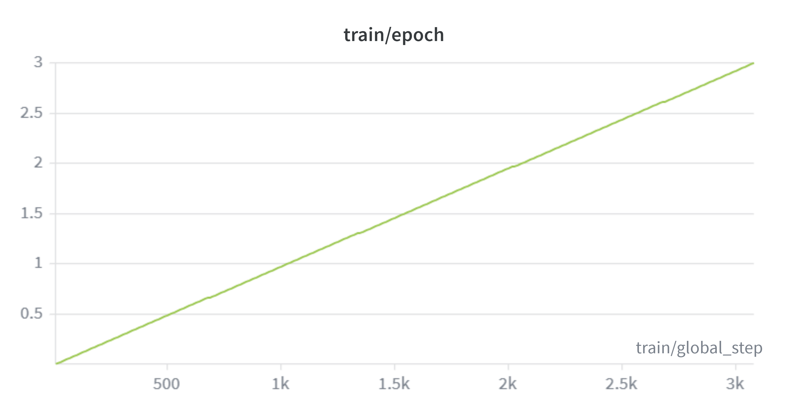

# Code LLM — Fine-Tuned Llama 3.2 3B for Python Generation

Fine-tuned Llama 3.2 3B on 16,430 Python instruction pairs using QLoRA.
Converted to GGUF and served locally via Ollama. No cloud API required.

## Results

| Model | HumanEval pass@1 | Tok/sec | RAM | Size |
|---|---|---|---|---|
| llama3.2:3b (base) | ~28% | ~18 | 2.5 GB | 2.0 GB |
| codellm-Q4_K_M (fine-tuned) | TBD | TBD | TBD | 1.9 GB |
| codellm-Q8_0 (fine-tuned) | TBD | TBD | TBD | 3.2 GB |

*HumanEval results will be updated after evaluation.*

## Training Results

| Metric | Value |
|---|---|
| Final train loss | 0.485 |
| Final eval loss | 0.528 |
| Total steps | 3,081 |
| Epochs | 3 |
| Training time | ~8 hours |

## Hardware

- GPU: NVIDIA GeForce RTX 5050 Laptop GPU (8 GB VRAM, Blackwell sm_120)
- RAM: 16 GB
- OS: Windows 11

## Stack

- **Training:** PyTorch 2.11 + Unsloth + PEFT + TRL
- **Quantization (training):** bitsandbytes 0.49 (4-bit NF4 QLoRA)
- **Export:** llama.cpp GGUF conversion + quantization
- **Serving:** Ollama + FastAPI
- **Eval:** HumanEval pass@1
- **Experiment tracking:** Weights & Biases

## Pipeline

Dataset → Format → QLoRA Fine-tune → Merge → GGUF → Eval → Serve

## Training

- Base model: `meta-llama/Llama-3.2-3B-Instruct`
- Dataset: `iamtarun/python_code_instructions_18k_alpaca` (18,612 samples)
- After filtering: 16,430 train / 1,826 validation
- Method: QLoRA via Unsloth — 4-bit NF4 base + LoRA adapters (r=16, alpha=32)
- Trainable parameters: 9,175,040 / 3,221,924,864 total (0.28%)
- Epochs: 3
- Effective batch size: 16 (per_device=2, grad_accum=8)
- Learning rate: 2e-4 with cosine scheduler + 5% warmup

## Training Curves

         

## GGUF Conversion

| Format | Size | BPW | Notes |
|---|---|---|---|
| fp16 | 6.1 GB | 16.00 | Baseline, not for inference |
| Q8_0 | 3.2 GB | 8.50 | Near-lossless |
| Q4_K_M | 1.9 GB | 5.01 | Recommended — best size/quality tradeoff |

Converted using llama.cpp `convert_hf_to_gguf.py` + `llama-quantize`.

## Notes on RTX 5050 (Blackwell)

This project was trained on an RTX 5050 Laptop GPU (sm_120, Blackwell architecture).
Standard bitsandbytes backward pass hangs on Blackwell + Windows. Resolved by using
Unsloth which rewrites the backward pass with custom CUDA kernels and has explicit
Blackwell support. If you're on an RTX 50 series GPU, use Unsloth — standard QLoRA
tutorials will not work out of the box.

## Reproduce

```bash
git clone https://github.com/yourusername/codellm
cd codellm

conda create -n codellm python=3.11 -y
conda activate codellm

pip install torch==2.11.0+cu128 torchvision torchaudio --index-url https://download.pytorch.org/whl/cu128
pip install unsloth
pip install bitsandbytes --prefer-binary --extra-index-url https://jllllll.github.io/bitsandbytes-windows-webui

python dataset.py
python train.py
```

> **Note:** Requires accepting Meta's Llama 3.2 license at huggingface.co/meta-llama/Llama-3.2-3B-Instruct and running `hf auth login` before training.

## Project Structure

-    codellm/
-       ├── dataset.py        # Download + format dataset into Llama 3.2 chat template
-       ├── train.py          # QLoRA fine-tuning via Unsloth
-       ├── merge.py          # Merge LoRA adapter into base model
-       ├── convert.py        # Export to GGUF + quantize (Q4_K_M, Q8_0)
-       ├── eval.py           # HumanEval pass@1 benchmark
-       ├── api_server.py     # FastAPI serving
-       └── data/             # Formatted dataset (gitignored)

## What I Learned

- How QLoRA works: 4-bit NF4 quantization + LoRA adapters train only 0.28% of parameters while the base model stays frozen
- Why chat templates matter: wrong format = model ignores instruction structure entirely, causing loss to never converge
- Blackwell GPU quirks: RTX 50 series requires Unsloth due to bitsandbytes backward pass incompatibility on sm_120
- Quantization tradeoffs: Q4_K_M gives ~95% quality at 31% of fp16 file size
- How to evaluate LLMs objectively: HumanEval pass@1 measures real code correctness by actually running generated code